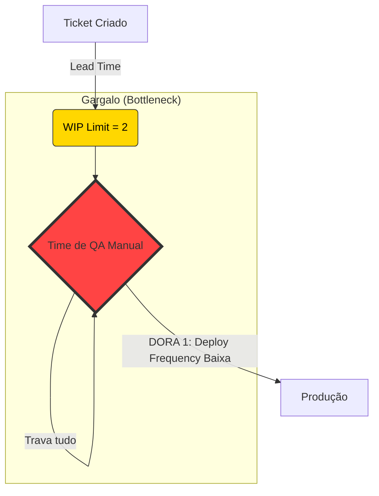

# 🏃‍♂️ Engenharia de Fluxo: A Verdadeira Face do Agile e DORA Metrics

O júnior acha que "Metodologia Ágil" significa ter uma reunião de 15 minutos em pé todos os dias (Daily Standup) e usar o Jira. Essa é a versão burocrática e morta do Ágil.

Engenheiros experientes sabem que o "Ágil" verdadeiro não é uma tabela de tarefas, é uma **Filosofia de Engenharia Contínua**, embasada em métricas severas e automação radical (DevOps e CI/CD).



## 1. O Falso Ágil (Water-Scrum-Fall)

Muitas empresas fingem ser ágeis mas cometem os piores *Anti-Patterns*:
- Elas fazem "Sprints" de 2 semanas onde o Dev escreve código, mas na hora de colocar em produção, precisa abrir um "Ticket" para a equipe de Infraestrutura aprovar (que leva mais 2 semanas).
- Isso é o modelo Cascata (Waterfall) disfarçado!

A verdadeira agilidade exige **Entrega Contínua (CI/CD)**. O código do Dev precisa ser compilado pelo GitHub Actions, testado com Mutational Testing, empacotado pelo Docker, e jogado no Kubernetes do cliente em 10 minutos após o Merge do Pull Request (PR), sem NENHUM toque humano no meio.

## 2. A Lei Científica da Elite DevOps: Métricas DORA

O *Google Cloud* liderou a maior pesquisa da história sobre o que faz uma equipe de tecnologia ser "Elite" (como as big techs) em vez de medíocre. Eles provaram que velocidade e segurança não são opostos; a automação gera as duas coisas simultaneamente.

Eles mapearam o sucesso através das 4 **DORA Metrics (DevOps Research and Assessment)**:
1. **Deployment Frequency (Frequência de Deploy):** Quantas vezes por dia você coloca código na mão do usuário? (Equipes elite fazem múltiplos deploys no mesmo dia).
2. **Lead Time for Changes (Tempo de Lead):** Quanto tempo demora entre você digitar a primeira linha de código até ela estar rodando em Produção? (Equipes elite levam menos de 1 hora).
3. **Change Failure Rate (Taxa de Falha):** Qual porcentagem dos seus deploys causam bugs graves no sistema? (Equipes elite ficam abaixo de 15%).
4. **Time to Restore Service (Tempo de Restauração/MTTR):** Se o servidor pegar fogo por um bug que você enviou, quanto tempo demora para o sistema voltar ao ar? (Rollbacks automatizados resolvem em minutos).

## 3. O Kanban Além das Colunas (Teoria das Restrições)

Olhe para o nosso Kanban Board ("BACKLOG", "DOING", "DONE"). O erro amador é usá-lo para "acompanhar em que passo o dev está".

A Ciência do Kanban foca na **Identificação de Gargalos (Gargalos limitam o rendimento do sistema inteiro)**. 
- Se você tem 50 cartas em `DOING` (Fazendo) e apenas 2 em `DONE` (Feito), você não está sendo produtivo, você apenas está gerando poeira e aumentando o estresse da equipe. Troca de contexto constante derrete a concentração humana.
- **A Solução:** O **WIP Limit (Work-In-Progress Limit)**. A coluna `DOING` deve ser forçada por sistema a não aceitar mais do que `N` cartas (ex: 3). A equipe inteira deve parar de tentar pegar novos problemas do Backlog, e ajudar o colega a terminar o problema atual para liberar espaço na coluna `DOING`! Isso aumenta a Frequência de Deploy (DORA 1).

### Código Prático: Automação Total para Melhorar as DORA Metrics (GitHub Actions)

O único jeito de melhorar o tempo de Lead (DORA 2) é tirando o ser humano do meio do caminho. Este arquivo em `.github/workflows/deploy.yml` entra em cena assim que você clica no botão "Merge" do Github. Ele compila, testa e joga em produção.

```yaml
name: Deploy Automático (CI/CD)

on:
  push:
    branches: [ "main" ] # Só roda quando alguém colocar código na Main

jobs:
  build-and-deploy:
    runs-on: ubuntu-latest
    steps:
    - name: Baixar o código
      uses: actions/checkout@v4
      
    - name: Rodar Mutational Testing (Stryker)
      run: npm ci && npm run test:mutation
      
    - name: Fazer Login na AWS
      uses: aws-actions/configure-aws-credentials@v4
      with:
        aws-access-key-id: ${{ secrets.AWS_ACCESS_KEY }}
        aws-secret-access-key: ${{ secrets.AWS_SECRET }}
        
    - name: Deploy da Infraestrutura via Terraform
      run: |
        terraform init
        terraform apply -auto-approve # Sem perguntas, atire em Produção!
```

> [!WARNING]
> **Sênior Mindset:** Se a sua equipe gasta mais tempo atualizando status em planilhas ou "passando o bastão" para equipes de QA manuais em vez de automatizar o pipeline, vocês não são uma equipe de Produto; vocês são uma equipe de burocracia que digita código. Acelere o Feedback Loop!

---

## 5. Equivalentes no Mercado (Agnosticismo Tecnológico)

- **Pipelines CI/CD Universais:** O `GitHub Actions` demonstrou como fazer o deploy. No mercado corporativo pesado, muitas empresas ainda usam **Jenkins** (configurado via Groovy/Java), **GitLab CI** (extensamente usado em infraestruturas on-premise) ou **Azure DevOps** (Ecossistema Microsoft C#).
- **Continuous Deployment vs Delivery:** Se o seu código sobe para produção *sem* um botão de aprovação humano, isso é *Deployment*. Se o código para em um ambiente Staging e exige que um QA aperte um botão, isso é *Delivery*. A elite DORA usa Deployment.
- **Feature Flags:** Para permitir que código inacabado suba para a *main* sem quebrar o cliente, times Elite usam gerenciadores de *Feature Flags* como **LaunchDarkly** ou **Unleash** (suportados em Node, Java, Go, Python).

---

## 6. Referências Oficiais de Estudo
- **O Estudo Definitivo do Google Cloud:** [DORA - DevOps Research and Assessment](https://dora.dev/)
- **O Livro Ouro de DevOps:** *Accelerate: The Science of Lean Software and DevOps* (Nicole Forsgren, Jez Humble, Gene Kim). A leitura deste livro é o que define um Tech Lead de sucesso mundialmente.
- **Kanban e WIP Limits:** *The Phoenix Project* (Gene Kim) - O romance que explica a Teoria das Restrições e Gargalos.

---

## 💻 Laboratório Prático: Automatizando sua primeira DORA Metric (Frequência de Deploy)

A teoria ágil diz "entregue valor rápido", mas a Prática Sênior diz "se não tem um robô fazendo isso, você está lento". Vamos montar um Pipeline CI (Integração Contínua) real usando GitHub Actions. Este é o passo número 1 para a sua equipe se tornar Elite em métricas DORA.

### Passo 1: O Cenário
Abra o VSCode em qualquer projeto Node.js simples que você tenha. O seu objetivo é garantir que **nenhum código quebre a compilação** antes de ir para produção.

### Passo 2: O Script Mágico
Na raiz do seu projeto, crie as pastas exatas: `.github/workflows/`.
Dentro dela, crie um arquivo chamado `dora-ci.yml`.

```yaml
# .github/workflows/dora-ci.yml
name: DORA Metrics - CI Pipeline

# 1. Este gatilho aciona o robô TODA VEZ que alguém faz um Pull Request para a main
on:
  pull_request:
    branches: [ "main" ]

jobs:
  qualidade-e-seguranca:
    name: Verifica Código Sênior
    runs-on: ubuntu-latest

    steps:
    # 2. O robô clona seu código do repositório
    - name: 🚚 Checkout do Código
      uses: actions/checkout@v4

    # 3. Prepara o ambiente Node.js
    - name: 📦 Instalar Node.js
      uses: actions/setup-node@v4
      with:
        node-version: '20'
        cache: 'npm' # Agiliza o Lead Time salvando pacotes na memória

    # 4. Instala as dependências de forma idêntica ao package-lock
    - name: ⚙️ npm ci (Clean Install)
      run: npm ci

    # 5. Roda testes de segurança ou linting
    # Se isso falhar, o botão de "Merge" no Github fica VERMELHO e bloqueado!
    - name: 🛡️ Audit de Segurança e Lint
      run: |
        npm audit
        # npm run lint (Descomente se tiver ESLint configurado)

    # 6. Roda os Testes Unitários
    - name: 🧪 Bateria de Testes
      run: npm test
```

### Passo 3: Feche o Ciclo Ágil
1. Commit esse arquivo no seu repositório do Github.
2. Nas configurações do Repositório (Settings > Branches), adicione uma *Branch Protection Rule* na branch `main`.
3. Marque a opção: **Require status checks to pass before merging** e digite `Verifica Código Sênior`.

**A Mágica Acontece:** 
Agora, seu Kanban Board virou uma máquina de verdade. Quando o Dev arrastar a carta para "Em Revisão" e abrir o Pull Request, o GitHub Actions vai rodar esse pipeline. 
Se o desenvolvedor júnior subir um código que quebra os testes, o robô vai bloquear o PR de ser fundido na Main. 
Isso **zera** a sua *Change Failure Rate* (Taxa de falha em Produção) e automatiza a Qualidade. É assim que uma equipe Agile de Elite trabalha.
