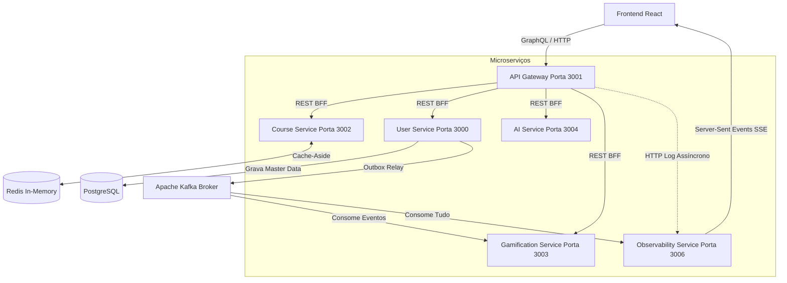

# 🧠 Intro: O Mindset do Arquiteto (Monolitos vs Microserviços)

Bem-vindo ao primeiro módulo do TechQuest. O objetivo deste curso não é ensinar você a programar um "To-Do List", mas sim elevar a sua mentalidade tática e estratégica para o nível de um **Software Engineer Sênior ou Arquiteto**.

Nesta introdução, abordaremos a transição evolutiva mais importante das arquiteturas modernas: a quebra de Monolitos em Microserviços.

## 1. O Que É e o Problema que Resolve

No início de qualquer startup, o sistema costuma ser um **Monolito**: uma única aplicação contendo o frontend, backend e o banco de dados tudo agrupado. Isso é rápido para criar e fácil de dar *deploy*.

O problema começa quando a empresa cresce:
- Se o módulo de "Relatórios" consumir muita memória RAM, ele trava e derruba o módulo de "Vendas" junto.
- Se 50 programadores mexerem no mesmo repositório, o risco de conflitos (Merge Conflicts) se torna assustador.
- Fazer deploy de uma simples alteração no CSS exige reiniciar o servidor de pagamentos.

**Microserviços** resolvem isso separando o sistema em pequenos programas independentes (como blocos de Lego) que conversam via rede (HTTP/REST, gRPC, ou Mensageria). Se o serviço de Gamificação cair, o serviço de Login continua operando perfeitamente.

### Dicionário Sênior
- **SPOF (Single Point of Failure):** Um componente que, se falhar, derruba todo o sistema. Monolitos são o maior exemplo de SPOF.
- **Coupling (Acoplamento):** O nível de dependência entre duas partes do sistema. Arquitetos sêniores buscam "Baixo Acoplamento" (Loose Coupling).
- **Resiliência:** A capacidade do sistema continuar operando de forma degradada, mas não cair totalmente quando há falhas parciais.

## 2. Vantagens e Desvantagens (Trade-offs)

| Recurso | Monolito 🧱 | Microserviços 🧩 |
| :--- | :--- | :--- |
| **Escalabilidade** | Difícil (Tem que duplicar tudo) | Cirúrgica (Escala só o que precisa) |
| **Resiliência** | Baixa (Um erro = Tudo cai) | Alta (Erro isolado por serviço) |
| **Complexidade Infra** | Muito Baixa (Basta dar 'npm start') | Altíssima (Docker, K8s, CI/CD, Rede) |
| **Consistência de Dados**| Garantida (ACID simples) | Complexa (Saga, Eventual Consistency) |

## 3. Cenário Ideal de Uso

**✅ Quando usar Monolitos (O "Majestic Monolith"):**
Sempre inicie com um Monolito! Se você está construindo um MVP, validando uma ideia de negócio ou sua equipe tem menos de 5 pessoas. Criar microserviços no dia zero é a definição máxima de *Overengineering*.

**❌ Quando migrar para Microserviços:**
- Quando equipes diferentes (Squads) não conseguem mais trabalhar no mesmo código sem pisar no pé do outro.
- Quando partes do sistema exigem escalas totalmente diferentes (Ex: A página de produto do e-commerce tem 10.000 visitas/s, mas o painel admin tem 1 visita/s).

## 4. O Padrão de Mercado

Hoje, os principais motores do mercado para orquestrar microserviços são:
- **Docker & Kubernetes:** Para isolamento e orquestração de contêineres.
- **Service Mesh (Istio / Linkerd):** Para gerenciar o tráfego interno e segurança entre os microsserviços.
- **API Gateways:** Kong, AWS API Gateway ou NGINX, servindo de porta de entrada unificada.

## 5. Deep Dive (Exemplo Prático: Arquitetura TechQuest)

No TechQuest, optamos por uma arquitetura distribuída híbrida (Event-Driven Microservices).
Veja o mapa arquitetural do que você está rodando agora:

### O Mapa Tecnológico (A Stack do Nosso Sistema)

Para garantir que você não se perca, aqui está a ficha técnica exata de cada microserviço que compõe o TechQuest e o **porquê** de usarmos cada ferramenta:

1. **API Gateway (NestJS + Apollo GraphQL)**
   - **Por quê?** Atua como Backend-For-Frontend (BFF). Ele possui um servidor GraphQL embutido que unifica as chamadas, possui interceptores JWT para proteger as rotas internas, e esconde toda a topologia de rede do Frontend.
2. **User Service (Express + Clean Architecture + PostgreSQL + JWT)**
   - **Por quê?** Coração do negócio. Assina e valida Tokens JWT. Usa Arquitetura Limpa para isolar regras de negócio, atuando como o Command (CQRS), enviando eventos ao Kafka (Outbox Pattern).
3. **Gamification Service (Fastify + KafkaJS)**
   - **Por quê?** A "Read Projection" (Query side). O Fastify processa assincronamente eventos do Kafka (`KANBAN_SYNC`) para gerenciar XP e Nível sem onerar o banco principal.
4. **Course Service (Express + Redis)**
   - **Por quê?** Serve as aulas em Markdown usando Fs. Com a evolução, injetamos o Redis com padrão *Cache-Aside*, reduzindo a latência de I/O em disco para memória RAM ultrarrápida.
5. **Observability Service (Express + KafkaJS + SSE)**
   - **Por quê?** Nosso "Cão de Guarda". Escuta todo o tráfego de rede assíncrono do Gateway e todos os tópicos do Kafka, cuspindo os dados via Server-Sent Events (SSE) para renderizar logs no navegador em tempo real (Modo Matrix).
6. **AI Service (LangChain + RAG + ChatOllama)**
   - **Por quê?** Responde às suas dúvidas de código lendo os próprios arquivos desta arquitetura via Geração Aumentada por Recuperação (RAG).
7. **Frontend (React + Vite + Dnd-kit + Vitest)**
   - **Por quê?** SPA robusta em Vite que consome os dados unificados (GraphQL), mantém conexões SSE abertas para telemetria ao vivo, e utiliza Contextos para gerenciar o seu Token de Acesso (JWT).

## 6. Checklist do Sênior (Perguntas de Entrevista)

1. *"Quais são os desafios de consistência de dados ao separar um Monolito em Microserviços?"*
2. *"Se o serviço A precisar urgentemente dos dados do serviço B, você faria uma requisição REST síncrona ou usaria uma Fila assíncrona? Por quê?"*
3. *"O que é a falácia da rede confiável em sistemas distribuídos?"*
